# LasPay Card Management System

# Business & Operations Guide

| | |
|---|---|
| **Document Title** | LasPay Card Management System — Business & Operations Guide |
| **Document ID** | LasPay-CMS-001 |
| **Version** | 1.0 |
| **Status** | Client Ready |
| **Classification** | Confidential |
| **Prepared For** | LasPay |
| **Prepared By** | Karsaaz — CMS Delivery Team |
| **Last Updated** | August 2026 |

---

## Document control

| Version | Date | Author | Description |
|---------|------|--------|-------------|
| 1.0 | Aug 2026 | CMS Team | Initial client business guide with deployed UI screenshots |

| Role | Name | Signature | Date |
|------|------|-----------|------|
| Project Manager | | | |
| Business Lead | | | |
| Client Representative | | | |

---

## Table of contents

1. [Introduction](#1-introduction)
2. [Executive summary](#2-executive-summary)
3. [System overview](#3-system-overview)
4. [User roles & access](#4-user-roles--access)
5. [Business flows](#5-business-flows)
   - 5.1 [Sign in & dashboard](#51-sign-in--dashboard)
   - 5.2 [New card request](#52-new-card-request)
   - 5.3 [Card request approval (checker)](#53-card-request-approval-checker)
   - 5.4 [Card generation](#54-card-generation)
   - 5.5 [Card search & operations](#55-card-search--operations)
   - 5.6 [Change card status](#56-change-card-status)
   - 5.7 [Replacement request](#57-replacement-request)
   - 5.8 [Change card type](#58-change-card-type)
   - 5.9 [Cards by expiry date](#59-cards-by-expiry-date)
   - 5.10 [Card export to bureau](#510-card-export-to-bureau)
   - 5.11 [Master data setup (housekeeping)](#511-master-data-setup-housekeeping)
   - 5.12 [Security & access control](#512-security--access-control)
6. [Module reference](#6-module-reference)
7. [Appendix A — API summary](#appendix-a--api-summary)
8. [Appendix B — Glossary](#appendix-b--glossary)
9. [Appendix C — Screenshot index](#appendix-c--screenshot-index)
10. [Appendix D — Word document design](#appendix-d--word-document-design)

---

## 1. Introduction

### 1.1 Purpose

This document describes the **LasPay Card Management System (CMS)** from a **business and operations perspective**. It is intended for senior management and business teams who need to understand:

- What the system does
- How day-to-day card operations work
- Which screens users interact with at each step
- Which backend APIs support each business process

This guide complements the technical specification (`Technical.md`) and live Swagger documentation at `/swagger-ui.html`.

### 1.2 Scope

| In scope | Out of scope |
|----------|--------------|
| LasPay web CMS (admin portal) | Mobile app channel (separate guide) |
| Card production, operations, housekeeping | Core banking host internals |
| Security (users, roles, permissions) | Network / infrastructure design |
| Screenshots from deployed LasPay environment | Full API request/response schemas |

### 1.3 Audience

| Audience | How to use this document |
|----------|--------------------------|
| Senior management | Sections 2–3 and flow diagrams in Section 5 |
| Business / operations | Section 5 (step-by-step flows with screenshots) |
| QA / UAT | Flows + Appendix A (API mapping) |
| IT / integration | Appendix A + Swagger for full contracts |

---

## 2. Executive summary

**LasPay CMS** is a secure web platform for managing the full card lifecycle — from new card requests and dual-control approval through card generation, day-to-day operations, and bureau export.

### 2.1 Key capabilities

| Capability | Business value |
|------------|----------------|
| **Card production** | Controlled issuance with maker/checker approval before generation |
| **Operations** | Search, status changes, replacements, type changes, expiry management |
| **Housekeeping** | Configure products, card types, limits, branches, and reference data |
| **Security** | Role-based access, permission control, encrypted sessions |
| **Dashboard** | Real-time view of pending approvals, open requests, and operational KPIs |

### 2.2 Platform modules

The LasPay CMS is organised into five functional areas accessible from the main navigation menu:

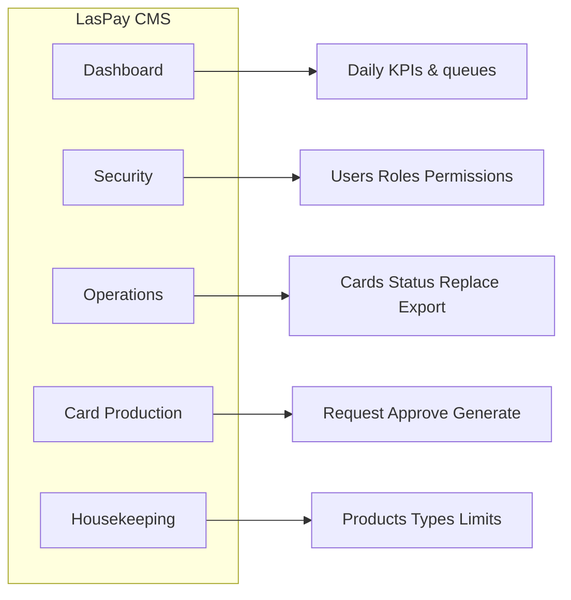

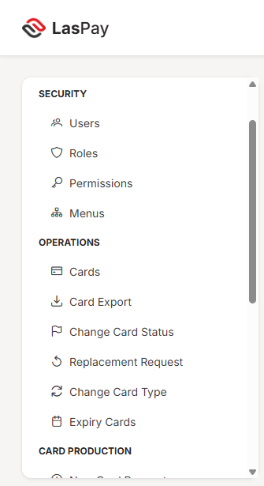

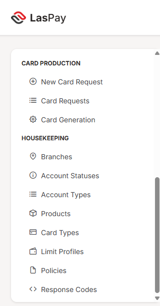

### 2.3 Flagship flow — new card issuance

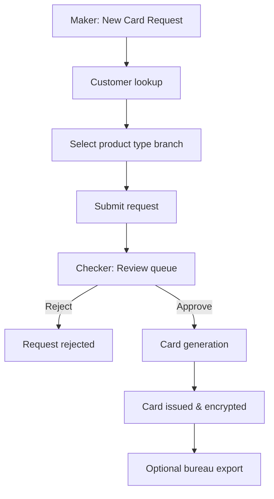

This end-to-end flow is documented in detail in [Section 5.2](#52-new-card-request) through [Section 5.4](#54-card-generation).

---

## 3. System overview

### 3.1 High-level architecture

```text
┌─────────────────────┐         ┌─────────────────────┐         ┌─────────────┐
│   LasPay Web UI     │  HTTPS  │   CMS REST API      │         │  Oracle DB  │
│   (Next.js portal)  │ ──────► │   (core-service)    │ ──────► │  (19c)      │
└─────────────────────┘         └─────────────────────┘         └─────────────┘
```

| Component | Role |
|-----------|------|
| **LasPay Web UI** | Browser-based portal for all CMS functions |
| **CMS REST API** | Business logic, validation, security, card processing |
| **Oracle database** | Persistent storage; card data encrypted at rest |

### 3.2 Security highlights

- **Encrypted session** — JWT-based authentication on every API call
- **Role-based access** — Users see only menus and actions permitted by their role
- **Dual control** — Card requests require checker approval before generation
- **PAN protection** — Card numbers displayed masked (e.g. `222333******5352`) in all list views
- **Audit trail** — System actions are logged for compliance (administrative review available to authorised users)

### 3.3 Sign-in screen

All users begin at the LasPay sign-in page. Access is restricted to authorised personnel.

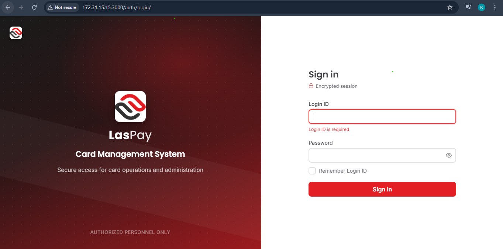

| Step | Action | API |
|------|--------|-----|
| 1 | User enters Login ID and password | — |
| 2 | System validates credentials and issues session token | `POST /api/auth/login` |
| 3 | User lands on Operations Dashboard | `GET /api/dashboard/summary` |

---

## 4. User roles & access

LasPay CMS uses **role-based access control (RBAC)**. Each user is assigned one or more roles that determine which menus and actions are available.

### 4.1 Typical roles

| Role | Typical user | Primary activities |
|------|--------------|-------------------|
| **Administrator** | IT / system admin | Users, roles, permissions, all modules |
| **Maker** | Branch operations staff | Create and edit card requests |
| **Checker** | Supervisor / authoriser | Approve or reject card requests |
| **Card Operator** | Card operations team | Card search, status, replacement, export |
| **Card Viewer** | Read-only users | View cards and reports |

### 4.2 Access model

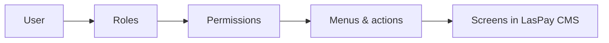

Permissions such as `CREATE_CARD_REQUEST`, `APPROVE_CARD`, and `EXPORT_CARD` gate specific business operations. See [Section 5.12](#512-security--access-control).

---

## 5. Business flows

Each flow below follows the same structure:

1. **Purpose** — why the business uses this process  
2. **Steps** — what the user does  
3. **Flow diagram** — visual overview  
4. **Screenshots** — from deployed LasPay environment  
5. **APIs** — backend endpoints that power the screen  
6. **Business rules** — key controls and outcomes  

---

### 5.1 Sign in & dashboard

**Purpose:** Provide a landing page after login with operational KPIs and quick access to pending work.

**Who:** All authenticated users

#### Steps

1. User signs in at the LasPay login page  
2. System loads the **Operations Dashboard**  
3. Dashboard shows: pending approvals, open requests, cards issued today, expiring cards, hot cards, and request status chart  
4. User navigates to any module from the left menu  

#### Screenshot

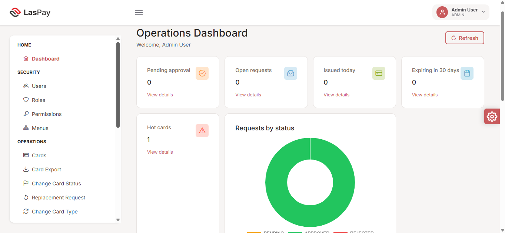

#### APIs

| Function | Method | Endpoint | Purpose |
|----------|--------|----------|---------|
| Sign in | POST | `/api/auth/login` | Authenticate user |
| Dashboard KPIs | GET | `/api/dashboard/summary` | Load queues, counts, charts |
| User menus | GET | `/api/my-menus` | Build navigation for current user |

#### Business rules

- Dashboard counts refresh on page load; user can click **Refresh** for latest data  
- KPI cards link to relevant detail screens (e.g. pending approval → card requests)  

---

### 5.2 New card request

**Purpose:** Allow a maker to submit a new card request for an existing or new customer account.

**Who:** Maker (or Admin with maker permissions)

#### Steps

1. Navigate to **Card Production → New Card Request**  
2. Enter **relationship number** — system loads customer and account options  
3. Select **existing account** or choose **new account**  
4. Complete **card details**: card title, product, card type, branch, supplementary count  
5. Submit the request — it enters the maker/checker workflow  

#### Flow diagram

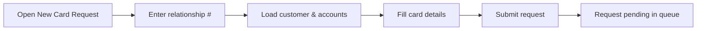

#### Screenshots

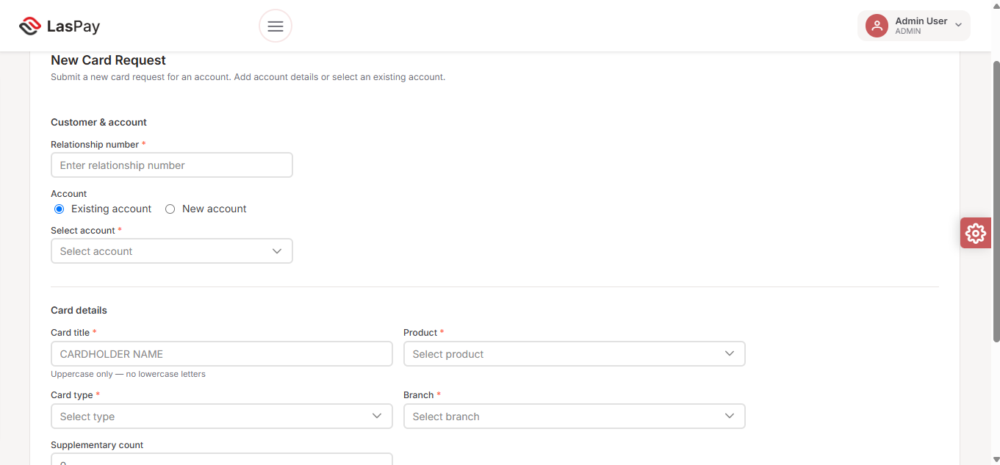


#### APIs

| Step | Method | Endpoint | Purpose |
|------|--------|----------|---------|
| Customer lookup | GET | `/api/card-requests/customer-info?relationshipNum=` | Load customer and accounts |
| Create request | POST | `/api/card-requests` | Submit new card request |
| Update request | PUT | `/api/card-requests/{id}` | Edit before approval |
| Dropdowns | GET | `/api/products`, `/api/card-types`, `/api/branches` | Product, type, branch lists |

#### Business rules

- Card title must be **uppercase** (no lowercase letters)  
- All fields marked with * are mandatory  
- Request appears in checker queue after submission  
- Maker cannot approve their own request (dual control)  

#### Outcome

| Result | Description |
|--------|-------------|
| **Success** | Request created with status **Pending**; visible in Card Requests queue |
| **Validation error** | Missing or invalid fields highlighted on form |

---

### 5.3 Card request approval (checker)

**Purpose:** Authorised checker reviews pending card requests and approves or rejects them.

**Who:** Checker (or Admin with approve permissions)

#### Steps

1. Navigate to **Card Production → Card Requests**  
2. View **Checker** queue — lists pending requests with customer, product, branch details  
3. Review request details (relationship, account, title, type, product)  
4. Click **Approve** to proceed to generation, or **Reject** to decline with audit record  
5. Approved requests move to card generation  

#### Flow diagram

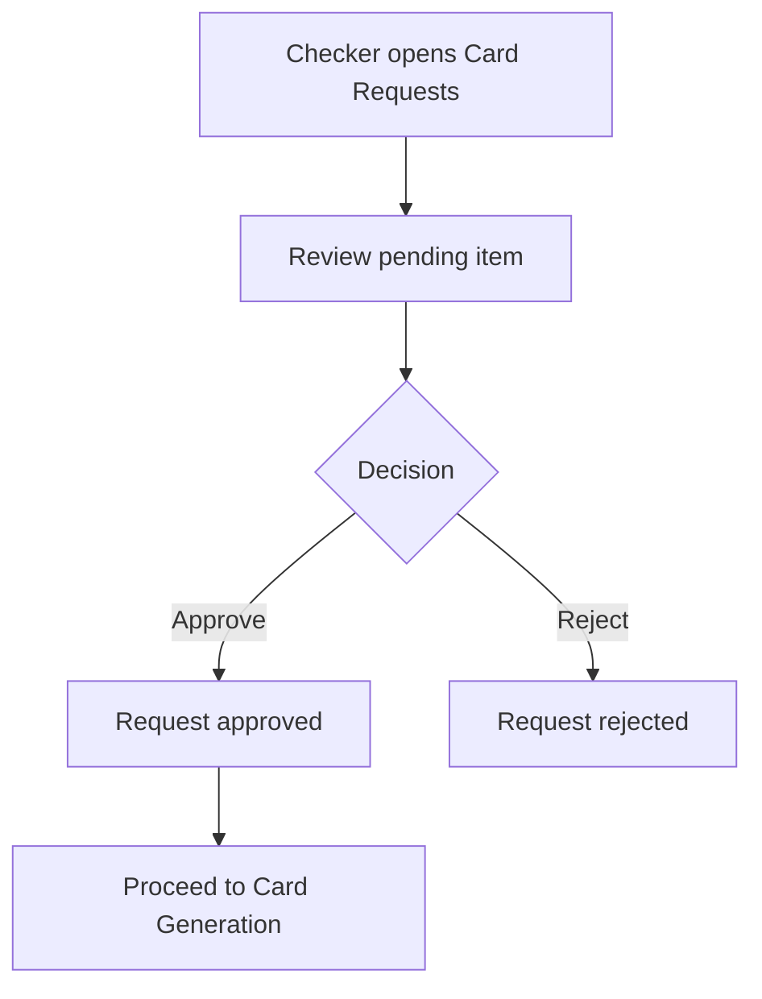

#### Screenshot


#### APIs

| Step | Method | Endpoint | Purpose |
|------|--------|----------|---------|
| Checker queue | GET | `/api/card-requests/checker` | List requests awaiting approval |
| Maker queue | GET | `/api/card-requests/maker` | List maker's requests |
| Reject | POST | `/api/card-requests/reject` | Reject with reason |
| Approve & generate | POST | `/api/card-generation/request/{id}/approve-and-generate` | Approve and create card |
| Search | GET | `/api/card-requests/search` | Find historical requests |

#### Business rules

- Only users with `APPROVE_CARD` permission can approve  
- Rejected requests remain searchable for audit  
- Progress shown as **Pending** until checker action  

#### Outcome

| Result | Description |
|--------|-------------|
| **Approved** | Request proceeds to card generation |
| **Rejected** | Request marked rejected; no card created |

---

### 5.4 Card generation

**Purpose:** Generate the physical/logical card record after checker approval.

**Who:** Card operations / generation operator

#### Steps

1. Navigate to **Card Production → Card Generation**  
2. Enter **relationship number** and **account number**  
3. Click **Load requests** — system shows approved requests for that account  
4. Process generation — card record created, PAN encrypted, optional bureau file prepared  
5. **Processed** column shows **Yes** when complete  

#### Flow diagram

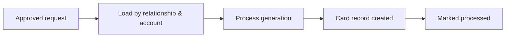

#### Screenshot


#### APIs

| Step | Method | Endpoint | Purpose |
|------|--------|----------|---------|
| Load requests | POST | `/api/card-generation/request-by-code` | Find requests by relationship & account |
| Approve & generate | POST | `/api/card-generation/request/{id}/approve-and-generate` | Generate card from approved request |
| Process | POST | `/api/card-generation/process` | Process generation for request ID |
| Update progress | PUT | `/api/card-generation/request/{id}/progress` | Update workflow progress flag |

#### Business rules

- Only approved requests appear for generation  
- Generated cards stored with encrypted PAN  
- Limit profile from product/card type applied on generation  

#### Outcome

| Result | Description |
|--------|-------------|
| **Success** | Card issued; processed flag = Yes; card visible in Operations → Cards |
| **Already processed** | Request shown as processed; no duplicate generation |

---

### 5.5 Card search & operations

**Purpose:** Search and manage existing cards across all operational functions.

**Who:** Card Operator, Admin

#### Overview

The **Operations** module provides unified card search used by multiple processes:

| Screen | Business use |
|--------|--------------|
| **Cards** | Primary card search and detail view |
| **Change card status** | Move card between Cold / Warm / Hot states |
| **Replacement request** | Request replacement card for lost/damaged cards |
| **Change card type** | Upgrade or change card product type |
| **Expiry Cards** | Find cards expiring in a date range; bulk renew or replace |
| **Card Export** | Export issued cards to bureau production file |

All operational search screens share common filters: PAN, relationship number, date range, card type.

#### APIs (shared)

| Function | Method | Endpoint | Purpose |
|----------|--------|----------|---------|
| Search cards | POST | `/api/cards/search` | Filter cards by criteria |
| Get card detail | GET | `/api/cards/{id}` | Full card information |
| Get dropdowns | GET | `/api/cards/dropdowns` | Filter options (types, statuses) |
| Customer lookup | GET | `/api/cards/customer-by-relation` | Customer info by relationship # |

---

### 5.6 Change card status

**Purpose:** Update a card's operational status (e.g. Cold → Warm → Hot) for fraud or lifecycle management.

**Who:** Card Operator

#### Steps

1. Navigate to **Operations → Change Card Status**  
2. Apply search filters (PAN, relationship, date range, card type)  
3. Click **Search** — results show current status per card  
4. Click **Change Status** on the target row  
5. Select new status and confirm  

#### Screenshot


#### APIs

| Step | Method | Endpoint | Purpose |
|------|--------|----------|---------|
| Search | POST | `/api/cards/search` | Find cards matching filters |
| Update status | PUT | `/api/cards/{id}` | Apply new card status |

#### Business rules

- Status values configured in housekeeping (Cold, Warm, Hot)  
- **Hot** cards flagged on dashboard for immediate attention  
- All status changes logged for audit  

---

### 5.7 Replacement request

**Purpose:** Initiate a replacement card when the existing card is lost, stolen, or damaged.

**Who:** Card Operator

#### Steps

1. Navigate to **Operations → Replacement Request**  
2. Search for the card by PAN, relationship, or date range  
3. Review card details (type, branch, status, expiry)  
4. Click **Request Replacement** on the selected card  
5. System marks card inactive and creates a new card request in the production queue  

#### Screenshot


#### APIs

| Step | Method | Endpoint | Purpose |
|------|--------|----------|---------|
| Search | POST | `/api/cards/search` | Find target card |
| Create replacement | POST | `/api/cards/{id}/replacement-request` | Mark inactive & create new request |

#### Business rules

- Original card deactivated upon replacement request  
- New request follows standard maker/checker/generation flow  
- Replacement source tagged in request queue  

---

### 5.8 Change card type

**Purpose:** Change an existing card from one type to another (e.g. Debit Standard → Credit Standard).

**Who:** Card Operator

#### Steps

1. Navigate to **Operations → Change Card Type**  
2. Search for the card  
3. Review current card type in results  
4. Click **Change Type** and select the new card type  
5. System creates a card type change request for processing  

#### Screenshot


#### APIs

| Step | Method | Endpoint | Purpose |
|------|--------|----------|---------|
| Search | POST | `/api/cards/search` | Find target card |
| Change type | POST | `/api/cards/{id}/change-card-type` | Create type change request |

#### Business rules

- New card type must be compatible with the card's product  
- Change request enters production workflow for approval if required  

---

### 5.9 Cards by expiry date

**Purpose:** Identify cards approaching expiry and perform bulk renewal or replacement.

**Who:** Card Operator

#### Steps

1. Navigate to **Operations → Expiry Cards**  
2. Set date range (from / to) and optional PAN filter  
3. Click **Search** — cards with expiry in range are listed  
4. Select cards via checkbox  
5. Click **Renew selected** (extend expiry) or **Replace selected** (create replacement requests)  
6. Use **View** on individual rows for card detail  

#### Screenshot


#### APIs

| Step | Method | Endpoint | Purpose |
|------|--------|----------|---------|
| Expiry search | POST | `/api/cards/expiry-search` | Find cards in date range |
| Bulk renew | POST | `/api/cards/bulk-renew` | Extend expiry on selected cards |
| Replacement | POST | `/api/cards/{id}/replacement-request` | Replace selected cards |

#### Business rules

- Dashboard shows count of cards **expiring in 30 days**  
- Bulk actions require at least one selected card  
- Renew extends expiry; replace creates new card request  

---

### 5.10 Card export to bureau

**Purpose:** Export issued cards ready for physical card bureau production.

**Who:** Card Operator with export permission

#### Steps

1. Navigate to **Operations → Card Export**  
2. Select **card type** filter  
3. Click **Search** — system finds cards with production status **Issued**  
4. Success message confirms count (e.g. "2 export-ready card(s) found")  
5. Select cards and export to bureau file  

#### Screenshot


#### APIs

| Step | Method | Endpoint | Purpose |
|------|--------|----------|---------|
| Find export-ready | POST | `/api/cards/export-ready` | List cards ready for bureau |
| Bulk export | POST | `/api/cards/bulk-export` | Generate bureau export file |
| Download file | GET | `/api/cards/{id}/export-file` | Download generated export file |

#### Business rules

- Only cards with status **Issued** appear in export search  
- Requires `EXPORT_CARD` permission  
- Export file generated to secured output directory  

---

### 5.11 Master data setup (housekeeping)

**Purpose:** Configure reference data required before card production and operations can run.

**Who:** Administrator

#### Setup order (recommended)


#### Screenshots

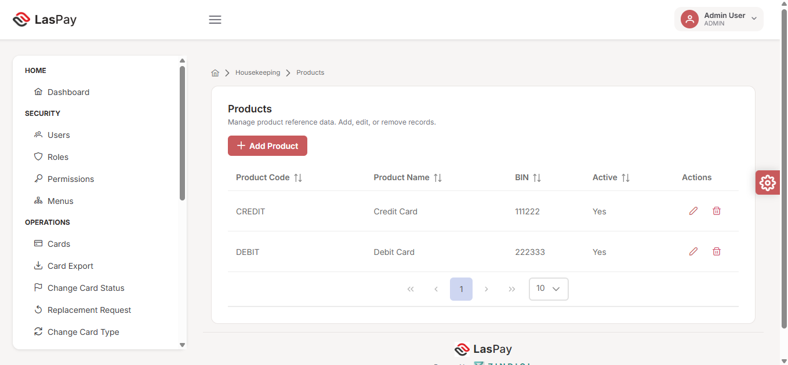


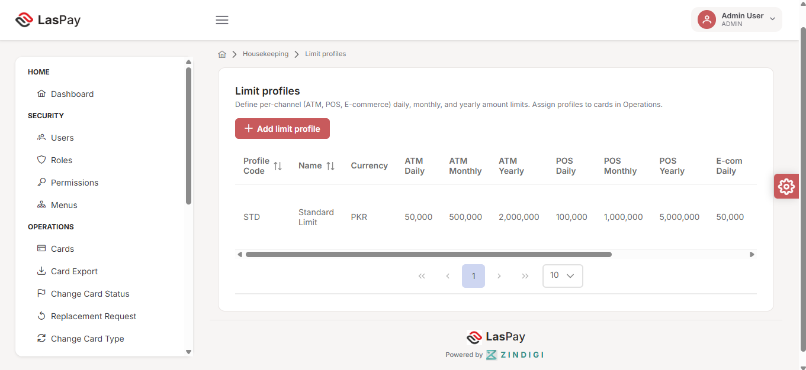

#### Key entities

| Entity | Example values | Used in |
|--------|----------------|---------|
| **Products** | Credit Card (BIN 111222), Debit Card (BIN 222333) | New card request product selection |
| **Card types** | Credit Standard, Debit Standard | Card type selection, export filter |
| **Limit profiles** | Standard Limit — ATM/POS/E-com daily/monthly/yearly | Applied on card generation |

#### APIs

| Entity | Base endpoint | Operations |
|--------|---------------|------------|
| Branches | `/api/branches` | CRUD |
| Products | `/api/products` | CRUD |
| Card types | `/api/card-types` | CRUD |
| Limit profiles | `/api/limit-profiles` | CRUD |
| Account types | `/api/account-types` | CRUD |
| Account statuses | `/api/account-statuses` | CRUD |
| Response codes | `/api/response-codes` | CRUD |
| Policies | `/api/policies` | CRUD |

#### Business rules

- Products and card types must be **Active** to appear in card request dropdowns  
- Each card type links to a product code  
- Limit profiles define per-channel caps (ATM, POS, E-commerce) in PKR  

---

### 5.12 Security & access control

**Purpose:** Manage who can access LasPay CMS and what actions they can perform.

**Who:** Administrator

#### Components

| Component | Function |
|-----------|----------|
| **Roles** | Define access groups (Admin, Card Operator, Card Viewer) |
| **Permissions** | Granular action rights (view, create, approve, export) |
| **Menus** | Control which navigation items each role sees |

#### Screenshots

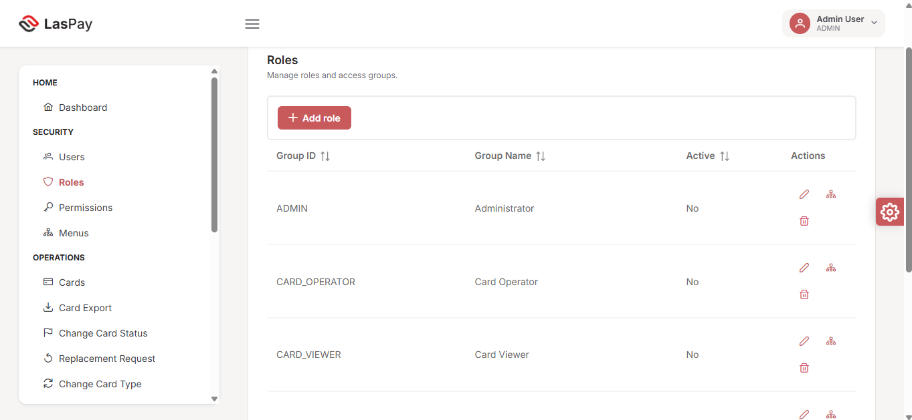

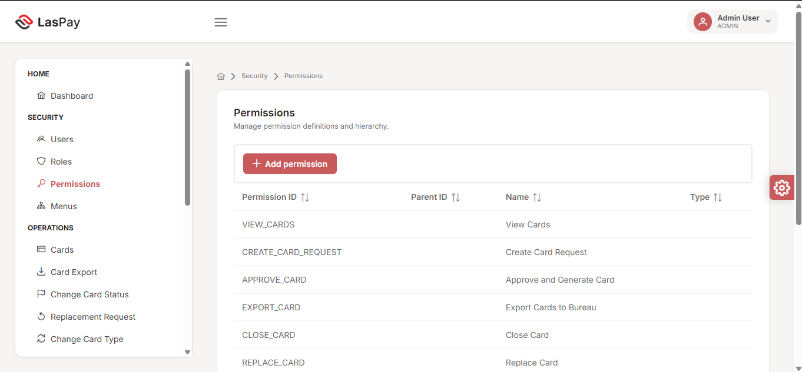

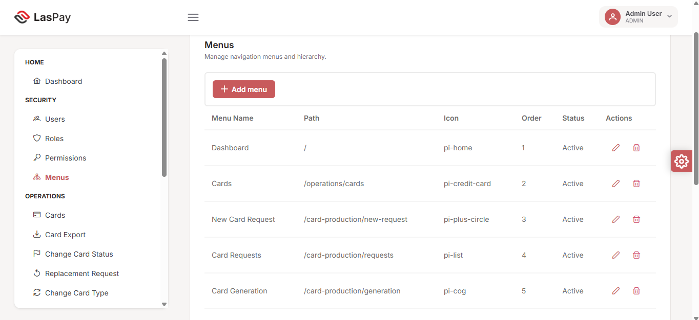

#### Key permissions (card operations)

| Permission ID | Name | Gates |
|---------------|------|-------|
| `VIEW_CARDS` | View Cards | Card search and detail screens |
| `CREATE_CARD_REQUEST` | Create Card Request | New card request form |
| `APPROVE_CARD` | Approve and Generate Card | Checker approval and generation |
| `EXPORT_CARD` | Export Cards to Bureau | Card export screen |
| `CLOSE_CARD` | Close Card | Card closure action |
| `REPLACE_CARD` | Replace Card | Replacement request action |

#### APIs

| Function | Method | Endpoint |
|----------|--------|----------|
| Users | CRUD | `/api/users` |
| Roles | CRUD | `/api/roles` |
| Permissions | CRUD | `/api/permissions` |
| Menus | CRUD | `/api/menus` |
| Assign roles | POST | `/api/users/{id}/roles` |

#### Business rules

- Users must have at least one active role to sign in  
- Menu visibility driven by role–menu mapping  
- Permission checks enforced on API for every protected action  

---

## 6. Module reference

Quick reference for all LasPay CMS menu items.

### 6.1 Home

| Screen | Route | Description |
|--------|-------|-------------|
| Dashboard | `/` | Operations KPIs, queues, charts |

### 6.2 Security

| Screen | Route | Description |
|--------|-------|-------------|
| Users | `/security/users` | Create and manage CMS users |
| Roles | `/security/roles` | Define access groups |
| Permissions | `/security/permissions` | Action-level permission definitions |
| Menus | `/security/menus` | Navigation menu configuration |

### 6.3 Operations

| Screen | Route | Description |
|--------|-------|-------------|
| Cards | `/operations/cards` | Search and view cards |
| Card Export | `/operations/cards/export` | Bureau export for issued cards |
| Change Card Status | `/operations/cards/change-status` | Update card status |
| Replacement Request | `/operations/cards/replacement` | Request card replacement |
| Change Card Type | `/operations/cards/change-type` | Change card type |
| Expiry Cards | `/operations/cards/expiry` | Expiry search and bulk actions |

### 6.4 Card Production

| Screen | Route | Description |
|--------|-------|-------------|
| New Card Request | `/card-production/new-request` | Submit new card request |
| Card Requests | `/card-production/requests` | Maker and checker queues |
| Search Requests | `/card-production/requests/search` | Search historical requests |
| Card Generation | `/card-production/generation` | Generate approved cards |

### 6.5 Housekeeping

| Screen | Route | Description |
|--------|-------|-------------|
| Branches | `/housekeeping/branches` | Branch reference data |
| Account Statuses | `/housekeeping/account-statuses` | Account status codes |
| Account Types | `/housekeeping/account-types` | Account type codes |
| Products | `/housekeeping/products` | Card products and BINs |
| Card Types | `/housekeeping/card-types` | Card type definitions |
| Limit Profiles | `/housekeeping/limit-profiles` | Transaction limit templates |
| Policies | `/housekeeping/policies` | Business policy rules |
| Response Codes | `/housekeeping/response-codes` | System response codes |

---

## Appendix A — API summary

Base URL: CMS REST API (core-service). All endpoints prefixed with `/api/`. Authentication: JWT Bearer token.

### Authentication

| Method | Endpoint | Purpose |
|--------|----------|---------|
| POST | `/api/auth/login` | Sign in |
| POST | `/api/auth/refresh` | Refresh token |
| POST | `/api/auth/change-password` | Change password |

### Dashboard

| Method | Endpoint | Purpose |
|--------|----------|---------|
| GET | `/api/dashboard/summary` | Dashboard KPIs and charts |

### Card requests

| Method | Endpoint | Purpose |
|--------|----------|---------|
| POST | `/api/card-requests` | Create request |
| GET | `/api/card-requests/maker` | Maker queue |
| GET | `/api/card-requests/checker` | Checker queue |
| POST | `/api/card-requests/reject` | Reject request |
| PUT | `/api/card-requests/{id}` | Update request |
| GET | `/api/card-requests/search` | Search requests |
| GET | `/api/card-requests/customer-info` | Customer lookup |
| GET | `/api/card-requests/{id}` | Get by ID |

### Card generation

| Method | Endpoint | Purpose |
|--------|----------|---------|
| POST | `/api/card-generation/request-by-code` | Load requests |
| POST | `/api/card-generation/request/{id}/approve-and-generate` | Approve & generate |
| POST | `/api/card-generation/process` | Process generation |
| PUT | `/api/card-generation/request/{id}/progress` | Update progress |

### Cards (operations)

| Method | Endpoint | Purpose |
|--------|----------|---------|
| POST | `/api/cards/search` | Search cards |
| GET | `/api/cards/{id}` | Card detail |
| PUT | `/api/cards/{id}` | Update card / status |
| POST | `/api/cards/{id}/replacement-request` | Replacement |
| POST | `/api/cards/{id}/change-card-type` | Type change |
| POST | `/api/cards/expiry-search` | Expiry search |
| POST | `/api/cards/bulk-renew` | Bulk renew |
| POST | `/api/cards/export-ready` | Export-ready search |
| POST | `/api/cards/bulk-export` | Bureau export |
| POST | `/api/cards/{id}/close` | Close card |

### Housekeeping

| Method | Endpoint | Purpose |
|--------|----------|---------|
| CRUD | `/api/branches` | Branches |
| CRUD | `/api/products` | Products |
| CRUD | `/api/card-types` | Card types |
| CRUD | `/api/limit-profiles` | Limit profiles |
| CRUD | `/api/account-types` | Account types |
| CRUD | `/api/account-statuses` | Account statuses |
| CRUD | `/api/response-codes` | Response codes |
| CRUD | `/api/policies` | Policies |

### Security

| Method | Endpoint | Purpose |
|--------|----------|---------|
| CRUD | `/api/users` | Users |
| CRUD | `/api/roles` | Roles |
| CRUD | `/api/permissions` | Permissions |
| CRUD | `/api/menus` | Menus |
| GET | `/api/my-menus` | Current user menus |

> **Full API detail:** Live Swagger UI at `/swagger-ui.html` when core-service is running.

---

## Appendix B — Glossary

| Term | Definition |
|------|------------|
| **BIN** | Bank Identification Number — first 6 digits identifying the card product |
| **Bureau** | External card personalisation / printing vendor |
| **Checker** | Authorised user who approves or rejects card requests (dual control) |
| **CMS** | Card Management System |
| **Cold / Warm / Hot** | Card status levels indicating activation and risk state |
| **Housekeeping** | Reference data configuration (products, types, branches, limits) |
| **Maker** | User who creates card requests |
| **PAN** | Primary Account Number — the card number (always masked in UI) |
| **Relationship number** | Customer identifier linking accounts and cards |
| **Dual control** | Two-person rule: maker creates, checker approves |

---

## Appendix C — Screenshot index

All screenshots captured from the deployed LasPay CMS environment.

| Figure | File | Screen | Section |
|--------|------|--------|---------|
| 3.1 | `1.png` | Sign in | 3.3 |
| 5.1 | `02-Dashboard.png` | Operations Dashboard | 5.1 |
| 2.1 | `03-menu.png` | Navigation — Security & Operations | 2.2 |
| 2.2 | `04-menus.png` | Navigation — Production & Housekeeping | 2.2 |
| 5.2.1 | `05-new-card-request.png` | New card request (empty) | 5.2 |
| 5.2.2 | `06-Existing customer .png` | Customer lookup | 5.2 |
| 5.2.3 | `07-Submit new card request.png` | Form completed | 5.2 |
| 5.3 | `08-Approve card.png` | Checker queue | 5.3 |
| 5.4 | `09-Card Generation.png` | Card generation | 5.4 |
| 5.11.1 | `10-Product.png` | Products | 5.11 |
| 5.11.2 | `11-Card Type.png` | Card types | 5.11 |
| 5.11.3 | `12-Card-limit-profile.png` | Limit profiles | 5.11 |
| 5.8 | `13-change card type.png` | Change card type | 5.8 |
| 5.7 | `14-request replacment.png` | Replacement request | 5.7 |
| 5.6 | `15-change card status.png` | Change card status | 5.6 |
| 5.9 | `16-card expiry.png` | Expiry cards | 5.9 |
| 5.10 | `17-card export.png` | Card export | 5.10 |
| 5.12.1 | `18-Roles.png` | Roles | 5.12 |
| 5.12.2 | `19-Permissions.png` | Permissions | 5.12 |
| 5.12.3 | `20-Menus.png` | Menu configuration | 5.12 |

**Screenshot folder:** `Laspay_Client_Screenshots/` (project root)

---

## Appendix D — Word document design

Use the following instructions when converting this guide to a client-ready **Microsoft Word (.docx)** presentation.

### Brand palette

| Use | Color | Hex |
|-----|-------|-----|
| Primary accent | LasPay red | `#E31E24` |
| Secondary accent | Soft red | `#C85A5C` |
| Dark headers | Brand black | `#1A1A1A` |
| Body text | Charcoal | `#3F3F46` |
| Captions | Muted grey | `#71717A` |
| Table header fill | Light grey | `#F4F2F1` |
| Page background | Warm surface | `#F7F5F4` |

### Typography

| Element | Font | Size |
|---------|------|------|
| Cover title | Poppins SemiBold | 28 pt |
| Heading 1 (chapters) | Poppins SemiBold | 18 pt |
| Heading 2 (sections) | Poppins Medium | 14 pt, color `#C85A5C` |
| Body | Inter Regular | 11 pt |
| Figure captions | Inter Italic | 9 pt, color `#71717A` |
| Footer | Inter | 8 pt |

### Page setup

- A4, margins 2.5 cm  
- Cover: black band with LasPay logo, title in white  
- Header: thin `#E31E24` rule + "LasPay Card Management System"  
- Footer: `LasPay-CMS-001 | Confidential | Page X of Y`  

### Images

- Insert all screenshots from `Laspay_Client_Screenshots/`  
- Center images; max width 16 cm; keep aspect ratio  
- Caption format: *Figure X.Y — Description* (italic, 9 pt)  
- Crop or blur any sensitive test data if needed  

### Diagrams

- Render Mermaid flowcharts as crisp PNG images (red/black palette)  
- Place diagrams before screenshot sections in each flow  

### Callout boxes

Use left-border callouts (4 px `#E31E24`, background `#FAF9F8`) for:

- Business rules in each flow  
- Security notes (PAN masking, dual control)  

### Do not include

- Third-party partner branding visible in screenshot footers — crop footers if present  
- Audit log screens or sections  
- Real customer PANs or live credentials  

### Conversion prompt

Copy this guide (`LasPay-CMS-Business-Guide.md`) together with the `Laspay_Client_Screenshots/` folder into Word/Pandoc/Claude and apply the design rules above to produce **LasPay-CMS-001 v1.0.docx**.

---

*© Karsaaz — LasPay Card Management System. Confidential. All rights reserved.*
